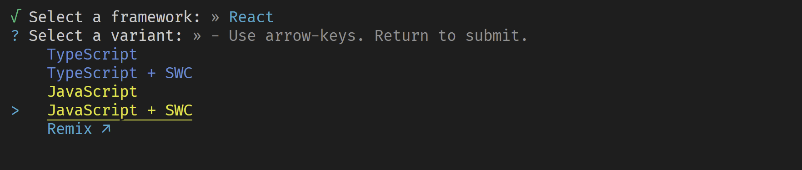

# ¿Qué es React?

- Es una biblioteca de Javascript para construir interfaces de usuario.
- Se puede utilizar también para aplicaciones móviles y para aplicaciones de terminal.
- Es adnóstica de la plataforma.
- React es declarativa y está basada en componentes.
- Es una biblioteca que es universal, se puede ejecutar tanto en el cliente como en el servidor.
- No es para hacer aplicaciones web completas, etc.

[Web Oficial](https://es.react.dev/)

[Documentación](https://es.react.dev/)

[Documentación Extra-oficial](https://www.reactjs.wiki/)

[One of the Best Repos](https://github.com/midudev/preguntas-entrevista-react)

[Repositorio oficial](https://github.com/facebook/react)

[Apps Móviles](https://reactnative.dev/) 

# ¿Por qué deberías aprender React?

- Es el frontend más demandado a nivel mundial.
- Con React Native puedes hacer aplicaciones móviles. [Showcase](https://reactnative.dev/showcase)
- Puedes realizar aplicaciones de escritorio. [Showcase](https://microsoft.github.io/react-native-windows/)
- React tiene su API estable a lo largo del tiempo. Gran parte de la sintaxis no ha cambiado, esto aumenta la facilidad de uso entre las versiones.

# ¿Cómo se convierte de JSX a Javascript?

- Se utiliza un empaquetador como puede ser Vite. [Vite](https://vitejs.dev/)
- 1º Ejecutar el comando npm init -y, esto inicializa nuestro package.json
- Para empezar a utilizarlo usamos: npm create vite@latest my-vue-app
- 
- Los comandos ahora es acceder al proyecto
- Ejecutar npm install y posteriormente npm run dev